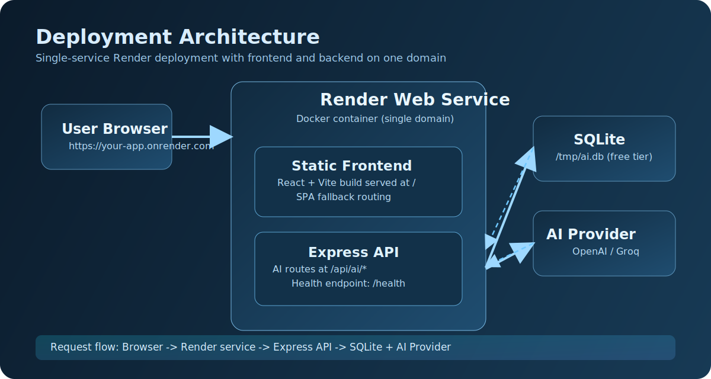

# Algorithm Visualizer

Algorithm Visualizer is an interactive full-stack web application for learning algorithms through animation, step-by-step state transitions, and guided explanations.

Live demo: https://algorithm-visualizer-7yk7.onrender.com

## What I built

- Sorting Visualizer
  - Implemented animated sorting workflows with interactive controls for run, reset, speed, and input size.
  - Added runtime indicators such as comparisons, swaps, and execution history.
  - Included multiple quick sort pivot strategies for side-by-side behavior exploration.

- Pathfinding Visualizer
  - Implemented an editable graph workspace with support for weighted edges.
  - Added animated traversal and path rendering with visited and final-path states.
  - Included graph presets and random graph generation for fast experimentation.

- Dynamic Programming Section
  - Built an educational DP interface with step-based visualization of state updates.
  - Added compare and recursion-tree style views to explain approach differences.
  - Included dry-run style breakdowns and C++ reference implementations.

- AI Assistant Integration
  - Added AI workflows for explanation, chat, hints, optimization, and validation.
  - Implemented backend API routes and history persistence for AI interactions.

- Production Deployment
  - Integrated frontend and backend into a single deployed service URL.
  - Added Dockerized build flow and Render deployment configuration.
  - Added health and status endpoints for runtime verification.

## Architecture summary

- Frontend: React + TypeScript + Vite
- Backend: Express + TypeScript
- Database: SQLite
- AI provider support: OpenAI-compatible providers
- Deployment target: Render

## Running locally

Prerequisites:
- Node.js
- npm

Frontend:

```bash
npm install
npm run dev
```

Backend:

```bash
cd backend
npm install
cp .env.example .env
npm run db:init
npm run dev
```

## Deployment



- Deployment guide: DEPLOY_RENDER.md
- Render blueprint: render.yaml
- Container build: Dockerfile

## Additional documentation

- AI setup: AI_SETUP_GUIDE.md
- AI quick start: QUICK_START_AI.md

## License

MIT

## Author

Keshav
