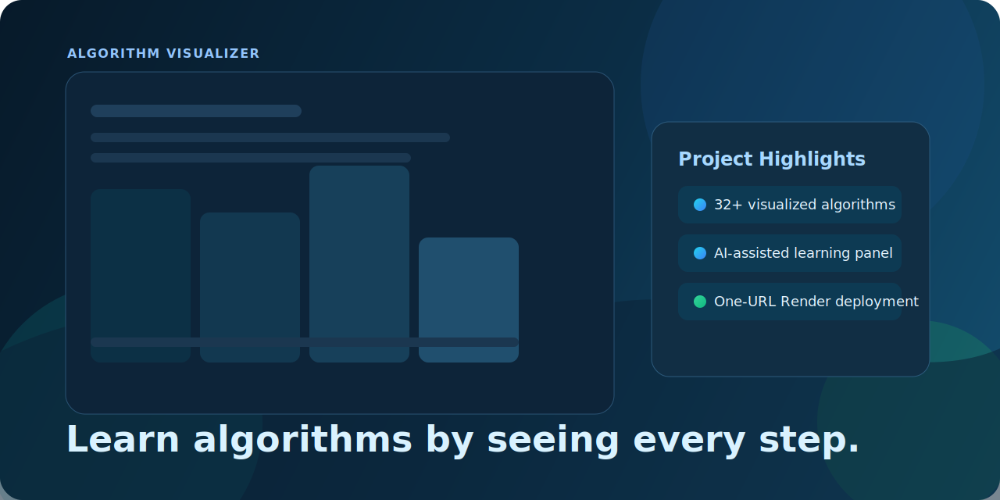
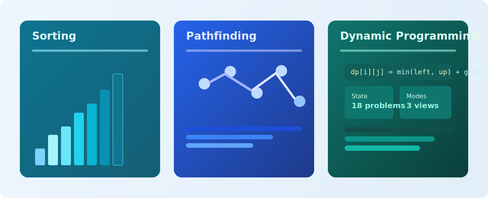
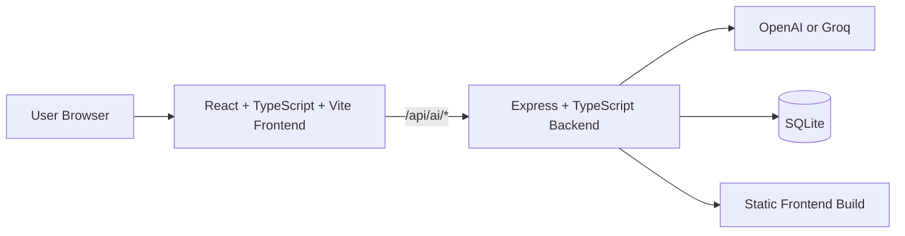

<div align="center">

# Algorithm Visualizer

<p align="center">
  
</p>

Interactive algorithm learning platform with real-time visual simulations, AI-assisted explanations, and resume-ready full-stack deployment.

[Live Demo](https://algorithm-visualizer-7yk7.onrender.com) | [Quick Start](#quick-start-local) | [Architecture](#architecture) | [Deployment](#deployment-render-single-url)


</div>

## At a glance

<table>
  <tr>
    <td align="center" width="25%"><strong>32+</strong><br/>Algorithms</td>
    <td align="center" width="25%"><strong>3</strong><br/>Core learning modules</td>
    <td align="center" width="25%"><strong>1</strong><br/>Single production URL</td>
    <td align="center" width="25%"><strong>TypeScript</strong><br/>Frontend + backend</td>
  </tr>
</table>

## What this project delivers

- Visual, interactive algorithm learning instead of static notes.
- Three complete modules: Sorting, Pathfinding, and Dynamic Programming.
- AI helper embedded in the UI for algorithm chat and code explanation.
- Production deployment with one public URL (frontend + backend together).
- Clean TypeScript codebase suitable for internship/resume portfolio review.

## Feature snapshot

| Module | Coverage | Highlights |
|---|---|---|
| Sorting Visualizer | 7 algorithms | Live bars, speed/size controls, pivot strategies, comparisons/swaps, run history |
| Pathfinding Visualizer | 7 algorithms | Editable weighted graphs, presets, random generation, path/cost statistics |
| Dynamic Programming Hub | 18 problems | Visual mode, compare mode, recursion tree, dry-run tables, C++ references |
| AI Assistant | Explain + Chat | Context-aware code explanation and interview-style algorithm Q&A |

## Visual preview

<p align="center">
  
</p>

## Algorithms included

### Sorting (7)

- Bubble Sort
- Selection Sort
- Insertion Sort
- Merge Sort
- Quick Sort (first, last, random, median-of-three pivot)
- Heap Sort
- Shell Sort

### Pathfinding (7)

- Breadth-First Search (BFS)
- Depth-First Search (DFS)
- Dijkstra
- A*
- Bellman-Ford
- Bidirectional Search
- Greedy Best-First Search

### Dynamic Programming (18)

- Climbing Stairs
- House Robber
- Coin Change
- Unique Paths
- Longest Common Subsequence
- Edit Distance
- 0/1 Knapsack
- Partition Equal Subset Sum
- Target Sum
- Longest Increasing Subsequence
- Russian Doll Envelopes
- Number of LIS
- Matrix Chain Multiplication
- Burst Balloons
- Palindrome Partitioning
- House Robber III
- Diameter Variants
- Tree Matching

## Architecture



## Tech stack

### Frontend

- React 19
- TypeScript
- Vite
- CSS

### Backend

- Node.js + Express
- TypeScript
- better-sqlite3
- OpenAI SDK (OpenAI/Groq compatible)

### DevOps

- Docker (multi-stage production image)
- Render Blueprint (`render.yaml`)

## Quick start (local)

### Prerequisites

- Node.js 18+
- npm

### Option A: Manual setup

```bash
# 1) Install frontend dependencies
npm install

# 2) Install backend dependencies
cd backend
npm install

# 3) Create backend environment file
cp .env.example .env

# 4) Initialize local SQLite database
npm run db:init
```

Run in two terminals:

```bash
# Terminal 1 (project root)
npm run dev
```

```bash
# Terminal 2
cd backend
npm run dev
```

App URL: `http://localhost:5173`

### Option B: Setup scripts

- Windows: `setup.bat`
- macOS/Linux: `./setup.sh`

### Option C: Docker Compose

```bash
docker-compose up --build
```

## Environment variables (backend)

Copy `backend/.env.example` to `backend/.env` and configure:

| Variable | Required | Description |
|---|---|---|
| `AI_PROVIDER` | Yes | `openai` or `groq` |
| `OPENAI_API_KEY` | If using OpenAI | OpenAI API key |
| `OPENAI_MODEL` | No | Default: `gpt-4o-mini` |
| `GROQ_API_KEY` | If using Groq | Groq API key |
| `GROQ_MODEL` | No | Default: `llama-3.1-8b-instant` |
| `DATABASE_PATH` | No | SQLite path (dev default `./data/ai.db`) |
| `FRONTEND_URL` | No | Allowed CORS origin(s) |
| `PORT` | No | Backend port (default `5000`) |

## API overview

Base route: `/api/ai`

| Method | Route | Purpose |
|---|---|---|
| GET | `/status` | Provider/model health |
| POST | `/explain` | Explain submitted code |
| POST | `/chat` | Ask algorithm questions |
| POST | `/hint` | Get graduated hints |
| POST | `/optimize` | Suggest optimizations |
| POST | `/validate` | Explain compile/runtime errors |
| GET | `/chat-history/:problemId` | Read chat history |
| GET | `/hint-history/:problemId` | Read hint history |
| GET | `/explanation-history/:problemId` | Read explanation history |

## Deployment (Render single URL)

This repository includes a production-ready single-service deployment:

- Dockerfile: `Dockerfile`
- Blueprint: `render.yaml`
- Step-by-step guide: `DEPLOY_RESUME_RENDER.md`

Production routes:

- Frontend: `/`
- Health: `/health`
- AI API: `/api/ai/*`

Free-tier note:

- Render free plan does not support disks.
- SQLite uses `/tmp/ai.db` in free-tier deployment, so data is ephemeral.

## Repository structure

```text
algorithm-visualizer/
  src/
    components/
      SortingVisualizer/
      PathfindingVisualizer/
      DPSection/
      AIAssistant/
  backend/
    src/
      routes/
      services/
      db/
  Dockerfile
  docker-compose.yml
  render.yaml
```

## Documentation

- AI setup guide: `AI_SETUP_GUIDE.md`
- AI quick start: `QUICK_START_AI.md`
- Resume deployment guide: `DEPLOY_RESUME_RENDER.md`

## Resume-ready highlights

- Full-stack TypeScript architecture (React + Express).
- Rich algorithm coverage (7 sorting + 7 pathfinding + 18 DP).
- AI-assisted education workflow with persistent history tracking.
- Production Docker build and public Render deployment.

## License

MIT

## Author

Keshav
